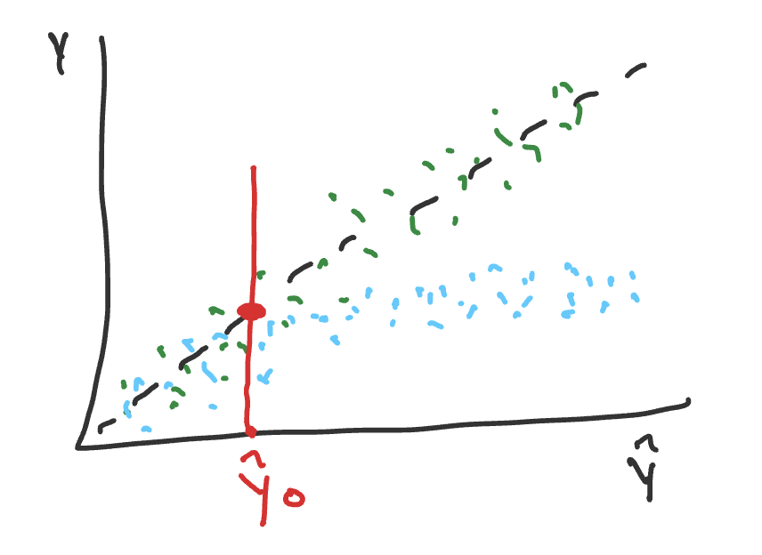
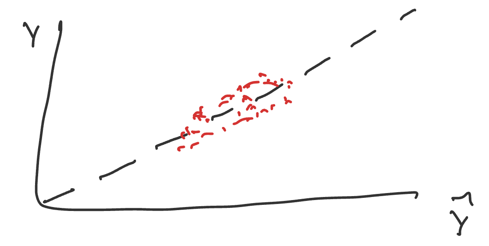
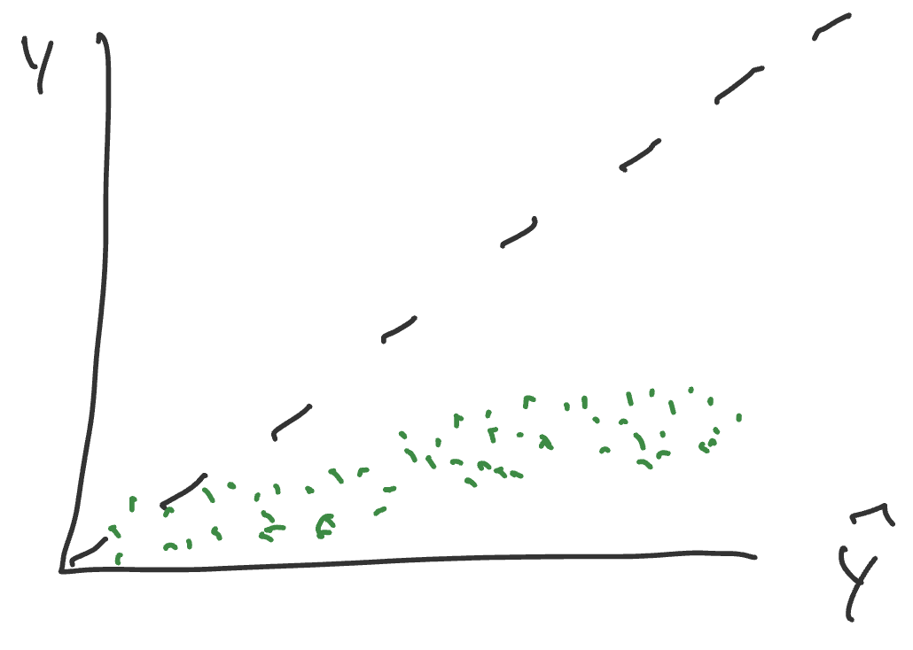

# Performance Measures

## In class exploration and discussion

### Exercise

Consider two generic prediction models $f_1$ and $f_2$ for univariate, continuous outcome $Y \in \mathbb{R}$ with multivariate predictors $X \in \mathbb{R}^d$. Without knowing anything about how the prediction models were created, describe how you might evaluate the performance of $f_1$ and $f_2$ if you know the true relationship between $X$ and $Y$. Try to be precise in your description, using mathematical notation if helpful.

> In class we discussed $X$ as a matrix $D$, for data, and $Y$ as an output vector or single number $P$, for predicitons. In between $D$ and $P$ there may be a $D'$ matrix where the data is transformed. The prediction is related to some target quantity that we care about.
> 
> One way we might validate the model, is to run $X$ through $f$ to get $\hat{Y}$, and then we can compare $\hat{Y}$ to $Y$. The specific formula from class is below:
> $$f: D -> D' -> P\qquad f(x_0) = {\hat{y_0}}\qquad  P \in \mathbb{R}$$
> 
> Then, we will have to consider what is the method of comparison between $Y$ and $\hat{Y}$?
> 
> Some options include the following one-number summary values:

> 1. Mean Squared Error: $$\text{MSE} = \frac{1}{n}\sum_{i=1}^{n}(y_i - \hat{y}_i)^2$$
> 2. Root Mean Squared Error: $$\text{RMSE} = \sqrt{\frac{1}{n}\sum_{i=1}^{n}(y_i - \hat{y}_i)^2}$$
> 3. Mean Absolute Error: $$\text{MAE} = \frac{1}{n}\sum_{i=1}^{n}|y_i - \hat{y}_i|$$

> Alternatively, we might use a visualization to evaluate this. We would plot $Y$ vs. $\hat{Y}$. 
>
> {width="75%"}
>
> The plot above is the calibration curve. It is more descriptive than the available one number-summaries listed.
>
> Q: What is the mathematical definition for "well-calibrated"? in the calibration curve?
> A: The expected value at $y$ given a specific $\hat{y}_0$ is equal to $\hat{y}_0$.
> $$\mathbb{E}[y \mid \hat{y}_0] = \hat{y}_0$$
> OR
> $$\mathbb{E}[y - \hat{y}_0 \mid \hat{y}_0] = 0$$
> Calibration is all about the average or expectation, NOT about the spread around the line.
> Discrimination is another metric that looks at tightness around the line.
> These measures will be overly optimistic if we use the same data that built the model.
> More robust definitions and exploration of these concepts are continued below.


### Exercise

Read [RMS 5.1.2](https://hbiostat.org/rmsc/validate#sec-val-index). Describe/define/develop an example of the following terms

1. Discrimination (rank based and variation based)

> Rank based discrimination is an assessment of whether predicted values are ordered correctly. From RMS 5.1.2, it is a rank correlation of $\hat{Y}$ and $Y$, with examples including Spearman’s $ρ$, Kendall’s $τ$, and Somers’ $D_{xy}$.
> Variation based discrimination is an assessment of whether the predicted values differ or spread across predictions. From RMS 5.1.2, it is a measure based on variation in $\hat{Y}$, with examples including the regression sum of squares and the $g$–Index.

2. Calibration

> Calibration is a measure of the average predictive accuracy for $f$. From RMS 5.1.2, these measures assess absolute prediction accuracy. *Calibration–in–the–large* compares the average $\hat{Y}$ with the average $Y$. Calibration curves are a part of the overall calibration measures definition.

3. Calibration curve

> This is a plots $Y$ values (actuals) versus $\hat{Y}$ values (predictions), which shows you the relationship between them, and can help assess performance at individual predicted values of $\hat{y}_0$.
> From RMS 5.1.2, a high-resolution calibration curve or *calibration–in–the–small* assesses the absolute forecast accuracy of predictions at individual levels of $\hat{Y}$.
> From class and as we can see below, this can help you observe calibration and discrimination.

> From Claude's assistance: <br>
> * Discrimination = "does it sort people correctly (and by how much)?" <br>
> * Calibration = "are its actual numbers trustworthy?"

### Exercise

1. Sketch a calibration curve that represents poor discrimination but good calibration

> {width="75%"}

> This plot is clustered around the line (good calibration), but it is not spread on $\hat{Y}$ (poor discrimination).


2. Sketch a calibration curve that represents good discrimination but poor calibration

> {width="75%"}

> This plot is spread on $\hat{Y}$ (good discrimination) but not following the line (poor calibration).

### Exercise [incomplete]

```r
# may need to be installed first pak::pak("thomasgstewart/ds6021b")
require(ds6021b)
```

Consider the three predictor setting: $X \in \mathbb{R}^3$. Let

$$X_1, X_2 \sim N(0,1)\qquad X_3\sim \text{BIN}(n=1, p=0.4)$$

$$Y\sim N(\mu({\mathbf X}),1)\qquad \mu({\mathbf X}) = \sqrt{5}\,\text{sigmoid}(X^2_1 + X_3) + \sqrt{5}\,\text{sigmoid}(X_2)\,X_3$$

1. Simulate data from the model.
2. Create the calibration curves for $f_1$ to $f_5$, which are in the `ds6021b` package.
3. Calculate a global measure of model performance.
4. Add a loess curve to the calibration curve as a measure of local performance.

## Student exploration

1. Select one of the papers from the list below

> Selected Paper: [Steyerberg et al. (2001)](https://www.sciencedirect.com/science/article/pii/S0895435601003419) - Internal validation of predictive models: efficiency of some procedures for logistic regression analysis

2. For the initial exploration, do the following:
   - Prepare a summary of the key ideas. Be prepared to describe/illustrate the concepts in a concrete example.
   - Review the instructions for the student presentation and come with an idea/sketch of the simulation you'll perform.

> **Key Ideas**
>
> 1. From the opening line of the abstract: *"The performance of a predictive model is overestimated when simply determined on the sample of subjects that was used to construct the model."* <br>
> The authors expand on this idea of optimism. When the model is trained and evaluated on only data within the sample, the estimated performance will be optimistic compared with the real performance on new data that is completely outside the sample. This difference is between apparent performance and test performance.
>
> 2. From the closing paragraph of the introduction: *"In this study we compare the efficiency of internal validation procedures for predictive logistic regression models."* (also basically the title lol) <br>
> The authors walked through a comparison of the split-sample approach (test-train splits), cross-validation, and bootstrapping. Each one is an internal validation procedure that is commonly used for evaluating models.
>
> 3. From the opening line of section 2.4: "We evaluated several internal validation procedures that aim to test performance more accurately than is achieved by the apparent performance estimate." <br>
> The authors set out to determine which validation procedure of those listed above is best for the logistic regression model in question. They used the GUSTO-I dataset, detailed below, and fit multiple regression models for prediction.
> 
> **Dataset:** GUSTO-I; n=40,830; 2,851 deaths <br>
> Working with a dataset of 30-day mortality after an acute myocardial infarction.
> What does that mean? They're looking at the % of patients who die from any cause within 30 days of a heart attack.
>
> **What they want us to do:**
> Stop doing CV and split-sample (test-train splits), and start doing regular bootstraping instead for estimation of accuracy!
> 
> **How they showed it:** Logistic regression was fitted in each sample with a previously specified set of eight dichotomous predictors (including shock, age>65, diabetes, etc).
> The apparent performance of the model fitted to the full GUSTO-I data was the reference point from which they compared the other performance measures. *"The large size of the total GUSTO-I data set makes sure that the optimism in this performance estimate is negligible."*
> As mentioned above, they compared variants of split-sample, cross-validation, and bootstrap (including the .632 and .632+ methods) specifically at EPV=10 to analyze estimates of model performance.
>
> **Some results:**
> 
> - The optimism and the variability of the model performance estimates reduced as sample size increased.
> - *"The regular bootstrap resulted in the most accurate estimates of model performance: the bias was close to zero and the variability similar to that of the apparent performance."*
> - Bootstrap resampling resulted in stable and nearly unbiased estimates of performance.
> - Relation to some other papers: *"a puzzling observation was that the .632 and the .632+ bootstrap variants were not superior to the regular bootstrap."*
> 
> **Definitions** <br>
>
> - *Events Per Variable (EPV)*: The number of outcome events (i.e. number of deaths) divided by the number of predictor variables in the model. Recommended to be at least 10 to provide an adequate predictive model. <br>
> - *Internal Validation*: All methods of assessing performance using only the dataset you were provided. <br>
> - *External Validation*: Assessing performance using a TRULY NEW dataset. Something from another clinic, a separate experiment, real world data, etc. <br>
> - *Apparent Performance*: Predictive performance estimated on the training sample. Optimistically biased, because the same data is used to fit and evaluate the model. <br>
> - *Test Performance*: Predictive performance estimated on the test data (held-out sample), an independent test set consisting of all patients from GUSTO-I except the patients in the random sample. <br>
> - *Optimism*: The difference between apparent performance and a model's true performance on new data. <br>
> - *Split-sample approach*: Randomly split training data in two parts: one to develop the model and another to measure its performance. <br>
> - *Cross-validation*: Model is developed on one part of the data and tested on the other part, while these samples are randomly taken repeatedly and the average is taken as an estimate of the performance. <br>
> - *Bootstrap*: Replicates the process of sample generation from an underlying population by drawing samples with replacement from the original data set, of the same size as the original data set. <br>
> - *Discrimination*: The ability to distinguish high-risk subjects from low-risk subjects. Commonly quantified by a measure of concordance, the *c* statistic. <br>
> - *Calibration*: Whether the predicted probabilities agree with the observed probabilities. Well-calibrated models have a slope of 1, while models providing too extreme predictions have a slope less than 1. Well-calibrated models also have an intercept of 0, while models providing predictions that are too high or too low on average have an intercept different from 0.

> **Sketch of the simulation**: Replicate a simulation from the paper 
> 
> The goal is to demonstrate that the regular bootstrap returns the optimal estimates of internal validity.
>
> - Start with the GUSTO-I dataset (from R or Python package)
> - Generate sample and independent test sets for EPV = 10
> - Complete split sample and regular boostrap on the sample dataset
> - Compare Predictive performance (*c* statistic, calibration slope, Brier score, D(=scaled$\chi^2$), $R^2$)
> 

3. For the student presentation, do one of the following and come prepared to present it to the class:
   - **Replicate a simulation or example from the paper** [SELECTION]
   - Develop your own simulation study which explores a concept discussed in the paper
   - Complete the simulation study described below.

> **Replicating the example from the paper**
> **Dataset:** GUSTO-I; n=40,830; 2,851 deaths <br>
> Available in full anonymized version via `predtools` package in R.

> **Figures:** Replicating a version of Figure 2 from the paper
> In the paper, figure 2 shows differences between estimated and test performance in data sets with EPV = 10, for apparent performance, split-sample validation on 50% or 33% of the sample, cross-validation on 50% or 10% of the sample, and regular bootstrapping. 
> In this simulation, I will show apparent performance, split-sample validation on 33% of the sample, and regular bootstrapping. I will also only show metrics for calibration and discrimination (*c* statistic, calibration slope, Brier score).

> **Methods:** Replicating the steps of the paper

> 1. Load in the dataset
> 2. Generate a sub-sample for EPV = 10 (set a seed to keep results steady)
> 3. Define logistic regression model with 8 predictors from the paper
> 4. Use model to compute the benchmark performance on the full dataset
> 5. Use model to compute apparent performance on sub-sample dataset
> 6. Use model to compute split-sample performance on sub-sample dataset
> 7. Use model to compute bootstrap performance on sub-sample dataset
> 8. Build figure 2 to compare performance!

```{r setup}

## Loading in Gusto-I dataset from predtools

#install.packages("predtools")
library(predtools)
data(gusto)

str(gusto)
```

> From the paper: *"A logistic regression model was fitted in each sample consisting of a previously specified set of eight dichotomous predictors: shock, age>65 years, high risk (anterior infarct location or previous MI), diabetes, hypotension (systolic blood pressure <100 mmHg), tachycardia (pulse>80), relief of chest pain>1 hr, female gender"*

> Variables we want are:
> 
> - Outcome: `day30`
> - Predictors:
> - Shock: `sho`
> - Age > 65 years: `age` (needs transform to binary)
> - High Risk: `ant` or `pmi` (needs transform to binary)
> - Diabetes: `dia`
> - Hypotension: `sysbp` (needs transform to binary)
> - Tachycardia: `pulse` (needs transform to binary)
> - Relief of chest pain > 1hr: `ttr`
> - Female gender: `sex`

```{r transform}

gusto_df <- data.frame(
   day30 = as.integer(gusto$day30),
   shock = as.integer(gusto$sho),
   age65 = as.integer(gusto$age > 65),
   highrisk = as.integer(gusto$ant == 1 | gusto$pmi == "yes"),
   diabetes = as.integer(gusto$dia),
   hypotension = as.integer(gusto$sysbp < 100),
   tachycardia = as.integer(gusto$pulse > 80),
   ttr = as.integer(gusto$ttr),
   female = as.integer(gusto$sex == "female")
)

head(gusto_df)

```

> All variables are now transformed to match the "eight dichotomous predictors" from the paper.

> From the paper: *"For example, for EPV=10 and 7.0% mortality, all training and test samples consisted of 1145 and 39,685 patients, with 80 and 2771 deaths, respectively."*
```{r sample}

## set seed for reproducibility
set.seed(17)

## EPV = 10 with 8 predictors requires 80 events (deaths)
target_events <- 80
target_non_events <- 1145-80 

## Stratified sampling to ensure desired number of events
# Split into events and non-events
events_pool     <- gusto_df[gusto_df$day30 == 1, ]
nonevents_pool  <- gusto_df[gusto_df$day30 == 0, ]

# Draw the stratified subsample
dev_events    <- events_pool[sample(nrow(events_pool), target_events), ]
dev_nonevents <- nonevents_pool[sample(nrow(nonevents_pool), target_non_events), ]

dev_sample <- rbind(dev_events, dev_nonevents)

# Shuffle row order so events aren't grouped together
dev_sample <- dev_sample[sample(nrow(dev_sample)), ]
rownames(dev_sample) <- NULL

```

> Samples created!

```{r model definition}

model_formula <- day30 ~ shock + age65 + highrisk + diabetes + hypotension + tachycardia + ttr + female

```

```{r benchmark-model}
benchmark_fit <- glm(model_formula, data = gusto_df, family = binomial())

benchmark_pred <- predict(benchmark_fit, type = "response")

```

> **To be continued...**

### Paper list

| Paper | Title |
|-------|-------|
| [Efron 1986](https://www.jstor.org/stable/2289236) | How Biased is the Apparent Error Rate of a Prediction Rule? |
| [Efron 1983](https://sites.stat.washington.edu/courses/stat527/s14/readings/Efron_jasa1983.pdf) | Estimating the Error Rate of a Prediction Rule: Improvement on Cross-Validation |
| [Efron 1997](https://www.jstor.org/stable/2965703) | Improvements on Cross-Validation: The .632+ Bootstrap Method |
| [Steyerberg et al. (2001)](https://www.sciencedirect.com/science/article/pii/S0895435601003419) | Internal validation of predictive models: efficiency of some procedures for logistic regression analysis |
| [Varma & Simon (2006)](https://bmcbioinformatics.biomedcentral.com/articles/10.1186/1471-2105-7-91) | Bias in error estimation when using cross-validation for model selection |
| [Bates, Hastie & Tibshirani (2023)](https://www.tandfonline.com/doi/full/10.1080/01621459.2023.2197686) | Cross-Validation: What Does It Estimate and How Well Does It Do It? |

### Simulation study (Efron and Tibshirani 1997)

The goal of Efron and Tibshirani 1997 was to persuade readers to use the 0.632+ bootstrap estimate of the error rate rather than alternatives. To demonstrate its superiority, the authors began with a simple simulation study involving a binary outcome $(Y_i)$ and two predictors $(\mathbf{T}_i = (T_{i1}, T_{i2}))$. The simulation study was to demonstrate that the variance of the estimator (and consequently the mean squared error) of the estimator was lower.

First, you will replicate the results presented in the paper.

**Data generation model**

$$Y_i \sim \text{BIN}(1, 0.5)$$

$$\mathbf{T}_i|Y_i=y_i \sim N_2\left(\left[\begin{array}{c} y_i-1/2 \\ 0\end{array}\right], I_2\right)$$

where $I$ is the identity matrix and $N_2$ is the bivariate normal distribution.

**Methods evaluated**

The paper only evaluated methods 1 and 2, but we list several more for the curious student.

1. Leave-one-out cross-validation (LOO CV)
2. 0.632+ bootstrap
3. 10-fold cross-validation
4. 0.632 bootstrap
5. Bootstrap
6. Naive

**Models evaluated**

The paper considers models 1 and 2, but an extension might consider more:

1. LDA
2. 1-NN
3. Regression with polynomial surface (linear or logistic)
4. Random forest
5. Neural net

**Simulation parameters**

1. N = 10, 20, 30, 40, 50, 75, 100

**Plan**

1. Before beginning the simulation, consider how you will display the results. Devise a figure that will succinctly show the results and support the goal of the paper.
2. Consider modular programming
3. Start with a single simulation setting (method/model/N).

<!--
### Extra notes for later

```{r}

library(ggplot2)

y <- c(1, 2, 3, 4, 5, 6, 7, 8, 9, 10)
yhat <- c(1, 2.5, 4, 3.4, 5, 6, 6.5, 10, 9, 11)

df <- data.frame(predicted = yhat, actual = y)

ggplot(df, aes(x = predicted, y = actual)) +
  geom_point(alpha = 0.6) +
  geom_abline(intercept = 0, slope = 1, color = "red", linetype = "dashed") +
  labs(x = "Predicted Values (yhat)",
       y = "Actual Values (y)") +
  theme_minimal()

```
-->

<!--
```{python}

2+2

```

-->