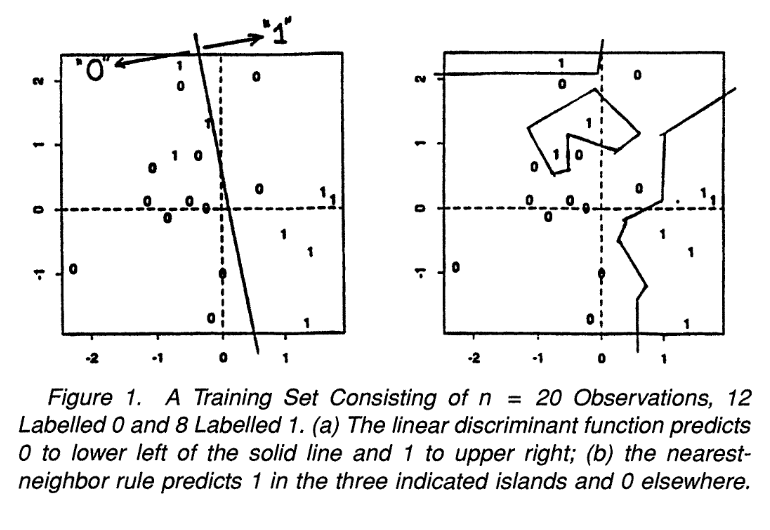
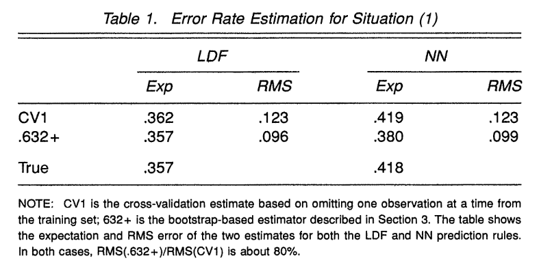

# Performance Measures Week 2

## Student exploration

Selected Paper: [Efron 1997](https://www.jstor.org/stable/2965703?seq=1) - Improvements on Cross-Validation: The .632+ Bootstrap Method

### Key Ideas

#### Stop doing X, Start doing Y!
- Cross-validation is the standard way to estimate prediction error, but it's not good enough.
- Stop doing cross-validation, because the estimate of prediction error can be highly variable, even though it has low bias.
- Instead, use the bootstrap method with the .632+ rule, which performs better. Bootstrap procedures are smoothed versions of cross validation, with adjustments made to correct for bias.

#### Key Findings
- Of the 24 simulations completed, the results vary from experiment to experiment, but in terms of RMSE, the .632+ rule is an overall winner.
- The improvement in reducing variability of error rate predictions in the set of simulations is roughly equivalent to a 60% increase in the size of the training set.
- Bootstrap replications that give an estimate of prediction error can also be used to assess the variability of that estimate, which would be useful for inference, model selection, or comparing two models. Only studied on the leave-one-out boostrap method.

#### Quick reminder
- What is cross validation?
    - Repeated evaluation with partitions of a dataset used as test-train splits to calculate an average estimate of model performance and a sense of variance in performance across folds
- What is bootstrapping?
    - Replicates the process of sample generation from an underlying population by drawing samples with replacement from the original data set, of the same size as the original data set.
    - Used here for estimating variability / uncertainty of error rates
- How are they different?
    - Normal CV partitions the data into a fixed, small number of discrete splits (k-folds), where each data point is used for testing exactly once
    - Leave-one-out CV trains on exactly n−1 points and tests on the 1 left-out point, repeated once per observation
    - Bootstrapping resamples with replacement, generating a huge number of possible "pseudo-datasets" that vary continuously in composition, rather than a handful of fixed partitions
    - Leave-one-out bootstrap draws many bootstrap samples with replacement and, for each observation i, averages its error only over the bootstrap samples that happened to exclude i. Each observation's error estimate is itself an average over many different training-set compositions
    - How is bootstrapping a "smooth" version?
        - Because the bootstrap is averaged over many compositions, while the CV methods are dependent on cutoffs or possible variability in individual point predictions
- Why is this better?
    - Smoother estimates tend to have lower variance, which is especially useful for small datasets where a handful of CV folds can each look very different from one another

#### How they showed it
- Focused on the situation when the response is dichotomous (outcomes are 0, 1). Two of the explored prediction rules were Fisher's linear discriminant function (LDF), and the nearest-neighbor (NN) rule. Examples of these are shown in figure 1. 

{width="70%" fig-align="center"}

- Showed cross-validation as a nearly unbiased estimator of true error rate for both LDF and NN, but bootstrap-based estimator has RMSE 80% as large. Table 1 shows these simulation results.

{width="70%" fig-align="center"}

- While the authors only studied classification problems with 0-1 loss, they claim that the results are non parametric, so they can be applied to any prediction rule. However, regression problems may have different behavior and the statistical approach may differ.

- Derived the Leave-one-out bootstrap estimator, which is a smoothed version of the leave-one-out cross-validation estimator. This is used in conjunction with the apparent error rate to create the .632 estimator, and in turn, the .632+ rule. Further explanation in the Equations section below.

$$
\widehat{\mathrm{Err}}^{(.632+)} = \widehat{\mathrm{Err}}^{(.632)} + \left(\widehat{\mathrm{Err}}^{(1)'} - \overline{\mathrm{err}}\right) \cdot \frac{0.368 \cdot 0.632 \cdot \hat{R}'}{1 - 0.368\,\hat{R}'}
$$

- Performed 24 sampling experiments, to investigate the effects of different classifiers, training set sizes, signal-to-noise ration, number of classes, and number of observations.

- The results vary considerably from experiment to experiment, but in terms of RMSE, the .632+ rule is an overall winner.

### Simulation Plan
Complete the simulation study outlined on the class notes page.

#### Simulation study (Efron and Tibshirani 1997)
The goal of Efron and Tibshirani 1997 was to persuade readers to use the 0.632+ bootstrap estimate of the error rate rather than alternatives. To demonstrate its superiority, the authors began with a simple simulation study involving a binary outcome $(Y_i)$ and two predictors $(\mathbf{T}_i = (T_{i1}, T_{i2}))$. The simulation study was to demonstrate that the variance of the estimator (and consequently the mean squared error) of the estimator was lower.

**Data generation model**

$$Y_i \sim \text{BIN}(1, 0.5)$$

$$\mathbf{T}_i|Y_i=y_i \sim N_2\left(\left[\begin{array}{c} y_i-1/2 \\ 0\end{array}\right], I_2\right)$$

where $I$ is the identity matrix and $N_2$ is the bivariate normal distribution.

**Methods evaluated**

1. Leave-one-out cross-validation (LOO CV)
2. 0.632+ bootstrap
5. Bootstrap

**Models evaluated**

1. LDA
2. 1-NN
3. Regression with polynomial surface (logistic)

**Simulation parameters**

1. N = 10, 20, 30, 40, 50, 75, 100

**Plan**

1. Before beginning the simulation, consider how you will display the results. Devise a figure that will succinctly show the results and support the goal of the paper.
2. Consider modular programming
3. Start with a single simulation setting (method/model/N).

### Definitions

- Cross Validation
    - Repeated evaluation with partitions of a dataset used as test-train splits to calculate an average estimate of model performance and a sense of variance in performance across folds
- Variance 
    - Model is too sensitive to training data, so it captures noise too. Poor prediction on unseen new data.
    - High variance = model is overfit
    - Low variance = model is more stable 
    - $\text{Variance} = \mathbb{E}\Big[ \big( \hat{f}(x) - \mathbb{E}[\hat{f}(x)] \big)^2 \Big]$
        - Where,
        - $\hat{f}(x)$ : predicted value by the model
        - $\mathbb{E}[\hat{f}(x)]$ : average prediction over multiple training sets
- Bias
    - Error that occurs when a model is too simple to capture the true patterns in the data.
    - High bias = model is underfit 
    - Low bias = model is better fit to patterns
    - $\text{Bias}^2 = \big( \mathbb{E}[\hat{f}(x)] - f(x) \big)^2$
        - Where,
        - $\hat{f}(x)$ : predicted value by the model
        - $f(x)$ : true value
        - $\mathbb{E}[\hat{f}(x)]$ : expected prediction over different training sets
- Error Rate
    - Apparent Error (rate): error rate calculated when evaluating the model on the data it was trained on, typically underestimates true error (optimistic)
        - also referred to as training error
    - True Error (rate): error rate calculated when evaluating the model on new / unseen data
        - also referred to as generalization error
    - Test Error (rate): error rate calculated on a held out test set, used to estimate true error 
    - No-Information Error (rate): error rate that would occurr if predictors had no relationship to the response
        - simulating what error looks like under pure guessing (section 3)
        - used by .632+ estimator to determine how much to trust the apparent error and bootstrap error
- Relative Overfitting Rate ($\hat{R}$)
    - a measure of how much a model is overfitting
    - scaled between 0 (no overfitting) and 1 (overfitting equal to the no-information value)
- Mean Squared Error (MSE)
    - Average of the squared differences between predicted values and actual values
- Prediction error
    - difference between predicted value and actual value (residual)
    - aggregated across many residuals using MSE, RMSE, or other statistics.
- Bootstrap
    - Replicates the process of sample generation from an underlying population by drawing samples with replacement from the original data set, of the same size as the original data set.
    - used here for estimating variability / uncertainty of error rates
- Point Estimate
    - A single value calculated from sample data used as the best guess for an unknown population parameter
    - Example: a computed error rate, such as apparent error, as a point estimate of the true error rate
- Parametric
    - Fixed number of parameters estimated form the training data and used to make predictions
    - Examples: Linear regression, logistic regression
- Nonparametric
    - Make few assumptions about functional form and relationships between variables
    - number of parameters grows with the size of the data and are flexible for modeling complex relationships
    - Example: k-NN, Decision Trees
- 0-1 loss
    - assignment of a 0 for a correct classification and a 1 for an incorrect classification
    - also called "indicator loss"
- Fisher's linear discriminant
    - classification method used as a prediction rule for separating data into classes or groups based on a linear boundary
    - smooth, because there is a single line dividing groups
- Nearest neighbors
    - classification method used for separating data into classes or groups based on the closest points
    - unsmooth, because the decision boundary is local to closest points

### Equations

**Equation 8:** leave-one-out cross-validation estimate of prediction error
$$
\widehat{\mathrm{Err}}^{(cv1)} = \frac{1}{n}\sum_{i=1}^n Q[y_i, r_{\mathbf{x}_{(i)}}(\mathbf{t}_i)] = \frac{1}{n}\sum_{i=1}^n Q(x_i, \mathbf{x}_{(i)})
$$
where $\mathbf{x}_{(i)}$ is the training set with the $i$th observation removed.

$Q[y, r]$ is the discrepancy between a predicted value $r$ and the actual response $y$.

Each observation is $x_i = (\mathbf{t}_i, y_i)$, where $\mathbf{t}_i$ is the predictor/feature vector and $y_i$ is the response.

$r_{\mathbf{x}}(\mathbf{t})$ denotes the prediction rule, fit on training set $\mathbf{x}$, evaluated at feature vector $\mathbf{t}$.

**Equation 14:** leave-one-out bootstrap estimator (smoothed version of cross-validation)
$$
\widehat{\mathrm{Err}}^{(1)} = \frac{1}{n}\sum_{i=1}^n E_{\hat{F}_{(i)}}\{Q(x_i, \mathbf{x}^{*})\}
$$
where $\mathbf{x}^{*}$ is a bootstrap sample drawn from $\hat{F}_{(i)}$, the empirical distribution on $\mathbf{x}_{(i)}$.

**Equation 24:** The equation for the .632 estimator from Efron (1983):
$$
\widehat{\mathrm{Err}}^{(.632)} = 0.368 \cdot \overline{\mathrm{err}} + 0.632 \cdot \widehat{\mathrm{Err}}^{(1)}
$$
This estimator is designed to correct upward bias in $\widehat{\mathrm{Err}}^{(1)}$ by averaging it with the downwardly biased estimate $\widehat{\mathrm{Err}}^{(.632)}$.

The coefficients .368 = $e^{-1}$ and .632 were suggested by an argument based on the fact that bootstrap samples are supported on approcimately .632n of the original data points.

The new equation for the .632+ rule, introduced by this paper, puts greater weight on $\widehat{\mathrm{Err}}^{(1)}$ in situations where the amount of overfitting $\widehat{\mathrm{Err}}^{(1)} - \overline{\mathrm{err}}$ is large.

**Equation 32:** This equation is used in the simulation experiments of section 4.
$$
\widehat{\mathrm{Err}}^{(.632+)} = \widehat{\mathrm{Err}}^{(.632)} + \left(\widehat{\mathrm{Err}}^{(1)'} - \overline{\mathrm{err}}\right) \cdot \frac{0.368 \cdot 0.632 \cdot \hat{R}'}{1 - 0.368\,\hat{R}'}
$$

**Equation 28:** The relative overfitting rate
$$
\hat{R} = \frac{\widehat{\mathrm{Err}}^{(1)} - \overline{\mathrm{err}}}{\hat{\gamma} - \overline{\mathrm{err}}}
$$
$\hat{R}$ ranges from 0, with no overfitting ($\widehat{\mathrm{Err}}^{(1)} = \overline{\mathrm{err}}$), to 1, with overfitting equal to the no-information value $\hat{\gamma} - \overline{\mathrm{err}}$.


### Simulation

1. Data generation model
$$Y_i \sim \text{BIN}(1, 0.5)$$

$$\mathbf{T}_i|Y_i=y_i \sim N_2\left(\left[\begin{array}{c} y_i-1/2 \\ 0\end{array}\right], I_2\right)$$

where $I$ is the identity matrix and $N_2$ is the bivariate normal distribution.

```{r generate-data}
#| code-fold: true
#| code-summary: "Show data generating function"

## Data generating function
## n: number of observations to simulate
## Returns a data frame with columns y, t1, t2 matching Equation (1)
generate_data <- function(n) {
  y  <- rbinom(n, size = 1, prob = 0.5)
  t1 <- rnorm(n, mean = y - 0.5, sd = 1)
  t2 <- rnorm(n, mean = 0, sd = 1)
  data.frame(y = y, t1 = t1, t2 = t2)
}

## Quick sanity check
set.seed(17)
sample_data <- generate_data(20)
#table(sample_data$y)
#head(sample_data)
plot(sample_data$t1, sample_data$t2)
```

2. Set up supporting functions
    - Q Loss Function
    - LDF Model
    - NN Model
    - 
```{r loss-function}
#| code-fold: true
#| code-summary: "Show loss function"

## Equation 2 Q[y, r]
## y is the response, r is the predicted value
## Vectorized: y and r can be vectors of the same length,
## returning a vector of 0/1 losses (mean() of this gives an error rate)
qloss_function <- function(y, r) {
  ifelse(r == y, 0, 1)
}

```

```{r ldf-model}
#| code-fold: true
#| code-summary: "Show LDF model setup and testing"

# LDA function comes from MASS library
library(MASS)

## Fit LDF on a training set and predict on given data
ldf_fit <- function(train_data) {
  lda(y ~ t1 + t2, data = train_data)
}

## Returns numeric 0/1 predictions (not the raw factor from predict())
ldf_predict <- function(fit, newdata) {
  pred <- predict(fit, newdata = newdata)
  as.numeric(as.character(pred$class))
}

## Sanity check: apparent error rate for one training sample (n = 20)
set.seed(17)
sample_data <- generate_data(20)
ldf_model <- ldf_fit(sample_data)
preds <- ldf_predict(ldf_model, sample_data)

apparent_error <- mean(qloss_function(sample_data$y, preds))
cat(sprintf("Apparent error for LDF model with n = %d observations: %.3f\n",
            nrow(sample_data), apparent_error))

```

```{r true-error}
#| code-fold: true
#| code-summary: "Show true error rate function"

## Equation 5: true error rate for a fitted model
## fit:        a fitted model object (e.g., from ldf_fit())
## predict_fn: the matching predict function (e.g., ldf_predict())
## n_test:     size of the large independent test set used to
##             approximate Err(x, F) -- the bigger n_test, the less
##             noise in this estimate itself
true_error <- function(fit, predict_fn, n_test = 20) {
  test_data <- generate_data(n_test)
  preds <- predict_fn(fit, test_data)
  mean(qloss_function(test_data$y, preds))
}

## Sanity check: true error for the LDF model fit earlier (n = 20 training sample)
true_err <- true_error(ldf_model, ldf_predict)
cat(sprintf("True error for LDF model (n_test = %d): %.3f\n", 20, true_err))

```

**Sources:**

- https://www.geeksforgeeks.org/machine-learning/bias-vs-variance-in-machine-learning/
- https://www.geeksforgeeks.org/machine-learning/parametric-vs-non-parametric-models-in-machine-learning/
- https://www.statology.org/prediction-error-statistics/
- Claude Sonnet 5
