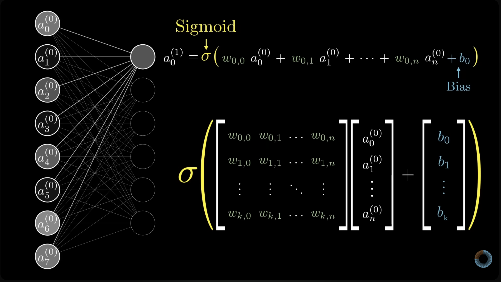
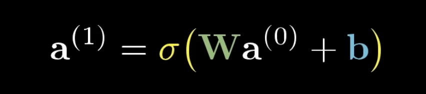

# Neural Net

### Motivating ideas and chronology

Our brains are incredible recognition and prediction machines. How do they work? Can we replicate the behavior artificially in a computer?

The provided papers give an chronology of the ideas in published literature.

1. McColloch & Pitts (1943): A Logical Calculus of the Ideas Immanent in Nervous Activity
    - Turning neuroscience into calculus.
    - The first mathematical model of a neural network using binary neurons for computation.
2. Rosenblatt (1958): The Perceptron: A probabilistic Model for Information Storage and Organization in the Brain
    - Tackles the questions of information storage and memory for how we regognize things.
    - Introducing the perceptron: the theory for a hpyothetical nervous system, or machine.
3. Rumelhart, Hinton & Williams (1986): Learning representations by back-propagating errors
    - Introducing back-propagation for "networks of neurone-like units".
    - New way to train networks with gradient descent on the errors, so that features can be discovered in hidden layers.

### Math behind the model

Let's jump into the notation and formulas with some visuals along the way to help out.

#### Some definitions

**Neuron**: The building block of a neural network.

- A function that takes inputs and produces a single number output (between 0 and 1)
- Inputs in the first set of neurons (first layer) are the predictors.
- Inputs in future sets of neurons (hidden layers) are weighted sums of outputs from the prior layer.

**Layers**: Arrangements of neurons.

- Input layer: the first layer of neurons that receives the predictors.
- Output layer: the final layer of neurons that produces the predictions $\hat{y}$
- Hidden layer: layers inbetween the input and output. Can be any number of layers we choose.
    - transforms output of the previous layer
    - able to distingush features and their relationships to the predictions

Simplest example: No hidden layers.

```{dot}
//| label: fig-nn-zero-layers
//| fig-cap: "A network with no hidden layers is equivalent to linear regression: the output is a linear combination of the inputs."
digraph nn0 {
  graph [rankdir=LR, splines=line, nodesep=0.6, ranksep=1.2]
  node [shape=circle, style=filled, fillcolor="#AED6F1", fontsize=13, width=0.55]
  x1 [label="x₁"]
  x2 [label="x₂"]
  node [fillcolor="#A9DFBF"]
  out [label="ŷ"]
  x1 -> out
  x2 -> out
}
```

Next example: One hidden layer.

```{dot}
//| label: fig-nn-one-layer
//| fig-cap: "A network with one hidden layer. Each hidden neuron applies a nonlinear activation function to a weighted sum of the inputs."
digraph nn1 {
  graph [rankdir=LR, splines=line, nodesep=0.5, ranksep=1.2]
  node [shape=circle, style=filled, fillcolor="#AED6F1", fontsize=13, width=0.55]
  x1 [label="x₁"]
  x2 [label="x₂"]
  node [fillcolor="#F9E79F"]
  h1 [label="h₁"]
  h2 [label="h₂"]
  h3 [label="h₃"]
  h4 [label="h₄"]
  node [fillcolor="#A9DFBF"]
  out [label="ŷ"]
  x1 -> h1; x1 -> h2; x1 -> h3; x1 -> h4
  x2 -> h1; x2 -> h2; x2 -> h3; x2 -> h4
  h1 -> out; h2 -> out; h3 -> out; h4 -> out
}
```

#### Some equations
Let's start with the example for the single hidden layer.
The full equation for going from input $\mathbf{x}$ to predicted $\hat{y}$ is

$$
\hat{y}(\mathbf{x}) = \mathbf{w}_{\text{out}}^t \,
  \sigma\!\left( W_1 \mathbf{x} + \mathbf{b}_1 \right) + b_{\text{out}}
$$

This is also called the "forward pass", to go from input $\mathbf{x}$ to a prediction $\hat{y}$.

- $W_1$ is the $m \times p$ **weight** matrix for the hidden layer, given a network with $p$ predictors and $m$ hidden neurons.
- $\mathbf{b}_1 \in \mathbb{R}^m$ is the hidden layer's **bias** vector
- $\sigma(\cdot)$ is a nonlinear activation function applied element-wise
- The hidden layer's outputs are then combined linearly using the output-layer weights $\mathbf{w}_{\text{out}} \in \mathbb{R}^m$ and bias $b_{\text{out}} \in \mathbb{R}$. 
- In @fig-nn-one-layer there are $p = 2$ inputs and $m = 4$ hidden neurons, so $W_1$ is a $4 \times 2$ matrix, $\mathbf{b}_1$ and $\mathbf{w}_{\text{out}}$ each have 4 entries, and each arrow in the figure is one weight.

Then we can consider the generalization of this function for multiple layers.

```{dot}
//| label: fig-nn-two-layers
//| fig-cap: "A network with two hidden layers. Each layer refines the representation of the previous layer, enabling hierarchical feature construction."
digraph nn2 {
  graph [rankdir=LR, splines=line, nodesep=0.45, ranksep=1.1]
  node [shape=circle, style=filled, fillcolor="#AED6F1", fontsize=11, width=0.5]
  x1 [label="x₁"]
  x2 [label="x₂"]
  node [fillcolor="#F9E79F"]
  h11 [label="h₁₁"]; h12 [label="h₁₂"]
  h13 [label="h₁₃"]; h14 [label="h₁₄"]
  node [fillcolor="#FADBD8"]
  h21 [label="h₂₁"]; h22 [label="h₂₂"]; h23 [label="h₂₃"]
  node [fillcolor="#A9DFBF"]
  out [label="ŷ"]
  x1 -> h11; x1 -> h12; x1 -> h13; x1 -> h14
  x2 -> h11; x2 -> h12; x2 -> h13; x2 -> h14
  h11 -> h21; h11 -> h22; h11 -> h23
  h12 -> h21; h12 -> h22; h12 -> h23
  h13 -> h21; h13 -> h22; h13 -> h23
  h14 -> h21; h14 -> h22; h14 -> h23
  h21 -> out; h22 -> out; h23 -> out
}
```

For this network, the output of each layer becomes the input to the next:

$$
\mathbf{h}^{(1)} = \sigma(W_1 \mathbf{x} + \mathbf{b}_1), \quad
\mathbf{h}^{(2)} = \sigma(W_2 \mathbf{h}^{(1)} + \mathbf{b}_2), \quad \ldots, \quad
\hat{y} = \mathbf{w}_{\text{out}}^t \mathbf{h}^{(L)} + b_{\text{out}}
$$

where $L$ is the number of hidden layers. @fig-nn-two-layers has $L = 2$: $W_1$ is $4 \times 2$ and $W_2$ is $3 \times 4$.

Those sigmas represent activation functions. These make the network nonlinear, so that it isn't just linear regression.

| Function    | Formula                           |
|-------------|-----------------------------------|
| **Sigmoid** | $\sigma(z) = \frac{1}{1+e^{-z}}$  |
| **ReLU**    | $\sigma(z) = \max(0, z)$          |
| **tanh**    | $\sigma(z) = \tanh(z)$            |

#### A larger visualization of the matrix

{#fig-3b1b-full width="90%" fig-align="center"}

{#fig-3b1b-compact width="50%" fig-align="center"}

**Note**: $\mathbf{a}$ is used in place of $\mathbf{h}$ here.

<!---
**Note on matrix sizes.** 3Blue1Brown uses slightly different notation for the same step: $\mathbf{a}^{(0)}$ is the input layer (our $\mathbf{x}$) and $\mathbf{a}^{(1)}$ is the first hidden layer (our $\mathbf{h}^{(1)}$). Its neurons are counted from 0, so layer 0 has $n+1$ neurons and layer 1 has $k+1$:

$$
\underbrace{\mathbf{a}^{(1)}}_{(k+1) \times 1}
= \sigma\Big(
  \underbrace{\mathbf{W}}_{(k+1) \times (n+1)} \,
  \underbrace{\mathbf{a}^{(0)}}_{(n+1) \times 1}
  + \underbrace{\mathbf{b}}_{(k+1) \times 1}
\Big)
$$

- $\mathbf{W}$ has one **row per neuron in the next layer** and one **column per neuron in the current layer**. Row $j$ holds every weight going into neuron $j$, and $w_{j,i}$ connects neuron $i$ to neuron $j$.
- The top equation in @fig-3b1b-full is just row 0 of this matrix product: $a_0^{(1)} = \sigma(w_{0,0} a_0^{(0)} + \cdots + w_{0,n} a_n^{(0)} + b_0)$.
- The inner dimensions ($n+1$) must match, and the result is a $(k+1) \times 1$ vector. $\sigma$ is then applied to each entry separately.
- In the course notation, $W_1$ is $m \times p$: $m = k+1$ hidden neurons and $p = n+1$ predictors. For @fig-nn-one-layer, $\underbrace{W_1}_{4 \times 2} \underbrace{\mathbf{x}}_{2 \times 1} + \underbrace{\mathbf{b}_1}_{4 \times 1}$ gives a $4 \times 1$ vector $\mathbf{h}^{(1)}$.
- Each layer's output size is the next layer's input size. In @fig-nn-two-layers, $W_2$ is $3 \times 4$ (4 neurons in, 3 out), and $\mathbf{w}_{\text{out}}^t$ is $1 \times 3$, which produces the single number $\hat{y}$.

--->

#### Training the model

The network is trained by minimizing a loss function over the training data. For a continuous outcome, the loss is mean squared error:

$$
\mathcal{L}(\mathbf{w}) = \frac{1}{n} \sum_{i=1}^n \bigl(y_i - \hat{y}(\mathbf{x}_i)\bigr)^2
$$

We minimize the loss function through **gradient descent**, where the weights are updated iteratively in the direction that reduces the loss most steeply. At each step,

$$
\mathbf{w} \leftarrow \mathbf{w} - \eta \, \nabla_{\mathbf{w}} \mathcal{L}
$$

$\eta > 0$ is the **learning rate**, which controls the size of each step. If it is too large, the optimizer diverges; if it is too small, convergence is slow. Other key training hyperparameters are the number of **epochs** (passes over the training data) and the **batch size** (how many observations are used to estimate each gradient update).

The gradients $\nabla_{\mathbf{w}} \mathcal{L}$ are computed efficiently by applying the chain rule backwards through the network, from the output layer to the first hidden layer. This procedure is called **backpropagation**.


#### Really helpful resource for explaining this



[Watch 3Blue1Brown Playlist for Deep Learning on Youtube](https://www.youtube.com/playlist?list=PLZHQObOWTQDNU6R1_67000Dx_ZCJB-3pi)

#### Computational Exploration

Below is an exploration of the neural networks math above using the [Run Club Marathon Performance Dataset](https://www.kaggle.com/datasets/likithagedipudi/run-club-marathon-performance-dataset/data) from Kaggle. This is a synthetic dataset created to simulate marathon training data for machine learning practice. It was generated with some realistic correlations based on sports science principles.

```{python get-kaggle}

import kagglehub
import pandas as pd

path = kagglehub.dataset_download("likithagedipudi/run-club-marathon-performance-dataset")

train_data = pd.read_csv(path + "/train.csv")
test_data = pd.read_csv(path + "/test.csv")

train_data.head()
```

##### Preparing the data

We'll predict a runner's `actual_finish_time_minutes` from two predictors, `running_experience_months` and `weekly_mileage_km`. With two inputs, the networks below match the figures and situation covered above (@fig-nn-zero-layers, @fig-nn-one-layer, and @fig-nn-two-layers).

The networks are trained on `train.csv` and evaluated on `test.csv`.

```{python}
from sklearn.preprocessing import StandardScaler

predictors = ["running_experience_months", "weekly_mileage_km"]
outcome = "actual_finish_time_minutes"

# drop the runners with no recorded finish time
train = train_data.dropna(subset=[outcome])
test = test_data.dropna(subset=[outcome])

X_train, y_train = train[predictors], train[outcome]
X_test, y_test = test[predictors], test[outcome]

# Standardize to mean 0, sd 1. Gradient descent struggles when values are on
# very different scales (months vs. km vs. ~300 minutes).
# The scalers are fit on the training data only.
x_scaler = StandardScaler().fit(X_train)
y_scaler = StandardScaler().fit(y_train.to_frame())

X_train_s = x_scaler.transform(X_train)
X_test_s = x_scaler.transform(X_test)
y_train_s = y_scaler.transform(y_train.to_frame()).ravel()
```

##### Training settings

Using scikit-learn's `MLPRegressor` (multi-layer perceptron) to set up the network definition function. In subsequent tests, we will only change the hidden layers argument. 

```{python}
from sklearn.neural_network import MLPRegressor
from sklearn.metrics import root_mean_squared_error

def make_network(hidden_layers, seed=1717):
    return MLPRegressor(
        hidden_layer_sizes=hidden_layers,  # neurons in each hidden layer
        activation="relu",                 # sigma(z) = max(0, z)
        solver="sgd",                      # (stochastic) gradient descent
        learning_rate_init=0.01,           # eta, the learning rate
        max_iter=100,                      # maximum number of epochs
        batch_size=64,                     # observations per gradient update
        alpha=0,                           # no penalty, so the loss is just MSE
        random_state=seed,                 # which random starting weights to use
    )

def predict_minutes(model, X_s):
    # the network predicts standardized y, so convert back to minutes
    y_s = model.predict(X_s)
    return y_scaler.inverse_transform(y_s.reshape(-1, 1)).ravel()
```

##### No hidden layers

If we set up the no hidden layers neural network, we simply have a linear regression: $\hat{y} = \mathbf{w}_{\text{out}}^t \mathbf{x} + b_{\text{out}}$. An empty tuple `()` in the make_network function gives us zero hidden layers.

```{python}
nn0 = make_network(hidden_layers=()).fit(X_train_s, y_train_s)

print("w_out:", nn0.coefs_[0].ravel(), " b_out:", nn0.intercepts_[0])

# compare to ordinary linear regression on the same data
from sklearn.linear_model import LinearRegression
lm = LinearRegression().fit(X_train_s, y_train_s)
print("linear regression coefficients:", lm.coef_)
print("linear regression intercept:", lm.intercept_)

print("Neural Network test RMSE (minutes):", root_mean_squared_error(y_test, predict_minutes(nn0, X_test_s)))
```

We can compare the two models and see that the coefficients are actually close between them here.

##### One hidden layer

With one hidden layer, we now introduce the non-linearity of the activation function in between the input and output. We'll use 4 neurons on our one hidden layer, like we had in the image @fig-nn-one-layer.

```{python}
nn1 = make_network(hidden_layers=(4,)).fit(X_train_s, y_train_s)

# coefs_ holds the weight matrices, intercepts_ holds the bias vectors
print("weight shapes:", [w.shape for w in nn1.coefs_])
print("bias shapes:  ", [b.shape for b in nn1.intercepts_])

print("Test RMSE (minutes):", root_mean_squared_error(y_test, predict_minutes(nn1, X_test_s)))
```

We recall the equation from above:

$$
\hat{y}(\mathbf{x}) = \mathbf{w}_{\text{out}}^t \,
  \sigma\!\left( W_1 \mathbf{x} + \mathbf{b}_1 \right) + b_{\text{out}}
$$

The first weight matrix is $2 \times 4$. scikit-learn stores it as $p \times m$, the transpose of our $m \times p$ matrix $W_1$, but it holds the same 8 weights (one per input-to-hidden arrow in @fig-nn-one-layer). The second is $\mathbf{w}_{\text{out}}$ with 4 entries.

##### Two hidden layers

Finally, let's set up the two hidden layers network. We use 4 neurons in the first hidden layer and 3 in the second, as in @fig-nn-two-layers.

```{python}
nn2 = make_network(hidden_layers=(4, 3)).fit(X_train_s, y_train_s)

print("weight shapes:", [w.shape for w in nn2.coefs_])
print("Test RMSE (minutes):", root_mean_squared_error(y_test, predict_minutes(nn2, X_test_s)))
```

Now there are three weight matrices: $W_1^t$ ($2 \times 4$), $W_2^t$ ($4 \times 3$), and $\mathbf{w}_{\text{out}}$ (3 entries).

##### Partial effects

Let's take a look at the partial effects plots for both of these varialbles.
A partial effect plot shows how the prediction changes as one predictor varies while the other is held constant (here at its median). Each variable runs from its 1st to 99th percentile, so we aren't plotting where there's almost no data.

```{python}
#| label: fig-nn-partial-effects
#| fig-cap: "Partial effects of each predictor for the three networks. Left: running experience varies with weekly mileage held at its median. Right: weekly mileage varies with running experience held at its median."
import numpy as np
import matplotlib.pyplot as plt

models = {
    "No hidden layers": nn0,
    "One hidden layer (4)": nn1,
    "Two hidden layers (4, 3)": nn2,
}
colors = ["#2a78d6", "#eb6834", "#1baf7a"]
labels = {
    "running_experience_months": "Running experience (months)",
    "weekly_mileage_km": "Weekly mileage (km)",
}

def partial_effect(model, variable):
    # every row starts with each predictor at its median...
    grid = pd.DataFrame({p: [X_train[p].median()] * 100 for p in predictors})
    # ...then the variable of interest sweeps across its range
    grid[variable] = np.linspace(X_train[variable].quantile(0.01),
                                 X_train[variable].quantile(0.99), 100)
    return grid[variable], predict_minutes(model, x_scaler.transform(grid))

fig, axes = plt.subplots(1, 2, figsize=(11, 4.5), sharey=True)
for ax, variable in zip(axes, predictors):
    for (name, model), color in zip(models.items(), colors):
        x, pred = partial_effect(model, variable)
        ax.plot(x, pred, color=color, linewidth=2, label=name)
    other = [labels[p] for p in predictors if p != variable][0]
    ax.set(xlabel=labels[variable], title=f"{other} held at its median")
    ax.spines[["top", "right"]].set_visible(False)
    ax.grid(alpha=0.3)
axes[0].set_ylabel("Predicted finish time (minutes)")
axes[0].legend(frameon=False)
fig.tight_layout()
plt.show()
```

From the partial effects plots we can observe a handful of things.

1. No Hidden Layers model only shows linear relationships.
2. Across all 3 models, Running Experience is the more influential feature in prediction.
3. The two hidden layers model starts to uncover progressively more information about the relationships.

##### Comparing the models

There was a little bit of weirdness when applying the random seed value for the gradient descent starting weights. In one case, where I used my favorite number 17, the RMSE for the third model (2 hidden layers) was significantly higher than the first two models and the partial effects plots were totally flat for both lines. So in the code below, we're going to train the networks with 5 different randomized starting positions to check how the RMSE may converge over multiple runs. 

```{python}

seed_results = []
for name, layers in [("No hidden layers", ()),
                     ("One hidden layer (4)", (4,)),
                     ("Two hidden layers (4, 3)", (4, 3))]:
    for seed in range(5):
        model = make_network(layers, seed=seed).fit(X_train_s, y_train_s)
        seed_results.append({
            "Model": name,
            "Test RMSE": root_mean_squared_error(y_test, predict_minutes(model, X_test_s)),
        })

pd.DataFrame(seed_results).groupby("Model", sort=False)["Test RMSE"].agg(["mean", "min", "max"]).round(2)

```

We see that the RMSE is smaller on average for the more complex model. That's not necessarily saying we must use the more complex model, but it is the behavior we expect from these models.


#### The curious case of seed 17...

Check this out. Maybe gradient descent doesn't like my favorite number `:(`

```{python}
from sklearn.neural_network import MLPRegressor
from sklearn.metrics import root_mean_squared_error

def make_network(hidden_layers, seed=17):
    return MLPRegressor(
        hidden_layer_sizes=hidden_layers,  # neurons in each hidden layer
        activation="relu",                 # sigma(z) = max(0, z)
        solver="sgd",                      # (stochastic) gradient descent
        learning_rate_init=0.01,           # eta, the learning rate
        max_iter=100,                      # maximum number of epochs
        batch_size=64,                     # observations per gradient update
        alpha=0,                           # no penalty, so the loss is just MSE
        random_state=seed,                 # which random starting weights to use
    )

def predict_minutes(model, X_s):
    # the network predicts standardized y, so convert back to minutes
    y_s = model.predict(X_s)
    return y_scaler.inverse_transform(y_s.reshape(-1, 1)).ravel()
```

```{python}
#| code-fold: true
nn0 = make_network(hidden_layers=()).fit(X_train_s, y_train_s)

print("w_out:", nn0.coefs_[0].ravel(), " b_out:", nn0.intercepts_[0])

# compare to ordinary linear regression on the same data
from sklearn.linear_model import LinearRegression
lm = LinearRegression().fit(X_train_s, y_train_s)
print("linear regression coefficients:", lm.coef_)
print("linear regression intercept:", lm.intercept_)

print("Neural Network test RMSE (minutes):", root_mean_squared_error(y_test, predict_minutes(nn0, X_test_s)))
```

```{python}
#| code-fold: true
nn1 = make_network(hidden_layers=(4,)).fit(X_train_s, y_train_s)

# coefs_ holds the weight matrices, intercepts_ holds the bias vectors
print("weight shapes:", [w.shape for w in nn1.coefs_])
print("bias shapes:  ", [b.shape for b in nn1.intercepts_])

print("Test RMSE (minutes):", root_mean_squared_error(y_test, predict_minutes(nn1, X_test_s)))
```

```{python}
#| code-fold: true
nn2 = make_network(hidden_layers=(4, 3)).fit(X_train_s, y_train_s)

print("weight shapes:", [w.shape for w in nn2.coefs_])
print("Test RMSE (minutes):", root_mean_squared_error(y_test, predict_minutes(nn2, X_test_s)))
```

```{python}
#| code-fold: true
import numpy as np
import matplotlib.pyplot as plt

models = {
    "No hidden layers": nn0,
    "One hidden layer (4)": nn1,
    "Two hidden layers (4, 3)": nn2,
}
colors = ["#2a78d6", "#eb6834", "#1baf7a"]
labels = {
    "running_experience_months": "Running experience (months)",
    "weekly_mileage_km": "Weekly mileage (km)",
}

def partial_effect(model, variable):
    # every row starts with each predictor at its median...
    grid = pd.DataFrame({p: [X_train[p].median()] * 100 for p in predictors})
    # ...then the variable of interest sweeps across its range
    grid[variable] = np.linspace(X_train[variable].quantile(0.01),
                                 X_train[variable].quantile(0.99), 100)
    return grid[variable], predict_minutes(model, x_scaler.transform(grid))

fig, axes = plt.subplots(1, 2, figsize=(11, 4.5), sharey=True)
for ax, variable in zip(axes, predictors):
    for (name, model), color in zip(models.items(), colors):
        x, pred = partial_effect(model, variable)
        ax.plot(x, pred, color=color, linewidth=2, label=name)
    other = [labels[p] for p in predictors if p != variable][0]
    ax.set(xlabel=labels[variable], title=f"{other} held at its median")
    ax.spines[["top", "right"]].set_visible(False)
    ax.grid(alpha=0.3)
axes[0].set_ylabel("Predicted finish time (minutes)")
axes[0].legend(frameon=False)
fig.tight_layout()
plt.show()
```


<!---
***

### 3b1b video 1 content

Neuron: A thing that holds a number [0, 1]
Input layer - every value comes from the feature / predictor set after normalization between 0 and 1
The number inside a neuron can be called its "activation"

Output layer - activation represents how much the system predicts the outcome

Activations of one layer determine activations of the next layer

Why layers?
- able to isolate / distinguish features and their relationships to the predictions
- divide and combine features within the input to produce the output

Weighted sum for each neuron
sum of all weights * activations = input for a given neuron in the next layer

we pump the weighted sum into an activation function so that values are between 0 and 1
- ex. Sigmoid function

activation for a neuron is basically a measure of "how positive is this weighted sum?"

if we want some bias for it to be inactive, then we add in a bias bector inside the activation function
- bias tells you how high the weighted sum needs to be before the neuron starts getting meaningfully active

Learning: Finding the right weights and biases

More accurate definition
Neuron: a function that takes in the outputs of all the numbers in the previous layer and spits out a number between 0 and 1

end notes:
ReLU is more common / easier to use now
- simplification of sigmoid
- faster to train, works well for deep neural networks

***

### 3b1b video 2 content

Introducing gradient decent and how networks learn

Start by initializing all the weights and biases randomly
then define a "cost" funciton to define the difference

"add up the squares of differences between bad outputs and what you wanted"
- the cost here is the MSE!

the average cost over all the training data is the Loss
- our measure for how bad the network is

Gradient descent:
- find the slope of the function at your given location
- then step in the direction that reduces the slope most steeply (right if slope is negative, left if slope is positive)
- this slope is computed at individual values of the loss function
- eventually you will get to a local minimum of the function

take negative gradient of entire weights vector inside the cost/loss function

Algorithm for computing the gradient efficiently is called "backpropogation"

When we talk about a network learning, we're simply talking about minimizing a cost function
- one consequence is that the cost function needs to have a nice smooth output
- that's why neurons are not binary, but able to vary [0,1]

every component of the negative gradient of the weights tells you how to change the weight and what matters more

Loss / cost function take in all weights and biases and outpus 1 number (the cost / loss)
- function from Tom's 5.4.4 section "training"

$$
\mathcal{L}(\mathbf{w}) = \frac{1}{n} \sum_{i=1}^n \bigl(y_i - \hat{y}(\mathbf{x}_i)\bigr)^2
$$

***

### 3b1b video 3 content

Backpropogation: an algorithm for computing the crazy complicated gradient

we can't change the activations, we can only change the weights and biases

adding together all of the desired effects gives us a list of "nudges" that we want to happen to the second to last layer, then the layer prior, etc. until we get back to the first layer and have "nudged" all the weights and biases
- "recursively apply" the process moving backwards through the network

This is all just a single training example, so you have to do back propogation for every training sample and average the backpropogaiton nudges over the whole training set
- this is loosely speaking the negative gradient of the cost/loss function

typically we split our training data into mini batches
get computational speed up by doing steps on each one of these instead of doing everything on the full dataset
"Stochastic gradient descent"

* backpropogation is the algorithm for determining how a single training example would like to nudge the weights and biases
* a true gradient descent step requires doing this for all training samples
* so instead we divide into mini batches and make the adjustements of back propogation for each mini batch
--->

### Sources:

1. Tom Stewart, Intro to Prediction Modeling: https://tgstewart.cloud/ipm/models-overview.html#sec-nnet
2. 3Blue1Brown, Neural Networks: https://youtube.com/playlist?list=PLZHQObOWTQDNU6R1_67000Dx_ZCJB-3pi&si=eTLONIqIN-zzii3t
3. McCulloch, W. S. & Pitts, W. (1943), A Logical Calculus of the Ideas Immanent in Nervous Activity, *Bulletin of Mathematical Biophysics* 5: 115-133
4. Rosenblatt, F. (1958), The Perceptron: A Probabilistic Model for Information Storage and Organization in the Brain, *Psychological Review* 65(6): 386-408
5. Rumelhart, D. E., Hinton, G. E. & Williams, R. J. (1986), Learning Representations by Back-Propagating Errors, *Nature* 323: 533-536
6. Kaggle Run Club Marathon Performance Dataset: https://www.kaggle.com/datasets/likithagedipudi/run-club-marathon-performance-dataset/data

### Future Reference:
1. http://neuralnetworksanddeeplearning.com/

<!---
PAPER SUMMARIES (draft for review; move what you want into the chapter)

McCulloch & Pitts (1943): A Logical Calculus of the Ideas Immanent in Nervous Activity
- The first mathematical model of a neuron. Because a neuron either fires or doesn't ("all-or-none"), its activity can be treated as a true/false proposition, and a network of neurons as a logical expression.
- Model neuron: adds up its excitatory inputs and fires if the sum exceeds a fixed threshold; any active inhibitory input blocks firing. This is the ancestor of "weighted sum + step activation."
- Showed that small nets realize AND, OR, and AND NOT, so any logical expression can be built out of these neurons. Nets with loops ("circles") can hold memory, and with a tape they can compute exactly what a Turing machine can.
- Key limitation: the connections and thresholds are fixed by hand and the net does not change over time, so there is no learning. (They argue learning can be *represented* by an equivalent fixed net, not that the net learns.)

Rosenblatt (1958): The Perceptron: A Probabilistic Model for Information Storage and Organization in the Brain
- Asks how information is stored and how it affects recognition. Takes the "connectionist" position: memory lives in the strength of connections, not in stored copies of images.
- Architecture: sensory units (S-points, the "retina") feed association units (A-units) through random connections, which feed response units (R-units). An A-unit fires when excitatory minus inhibitory input reaches a threshold $\theta$.
- Learning: each A-unit carries a "value" $V$ (essentially a weight) that grows when the unit is active and the response is reinforced. "Bivalent" versions let values go up or down (reward / punishment), which gives trial-and-error learning.
- Uses probability instead of symbolic logic: derives the probability of a correct response to a trained stimulus ($P_r$) and of correct generalization to a new stimulus ($P_g$). Generalization beats chance only when the classes really differ (a "differentiated environment"); with purely random stimuli there is nothing to generalize.
- Only the A-to-R connections learn; the S-to-A wiring is random and fixed.
- Limitation Rosenblatt names himself: the perceptron handles concrete patterns but not relationships ("Name the object left of the square"). "Some system, more advanced in principle than the perceptron, seems to be required."

Rumelhart, Hinton & Williams (1986): Learning Representations by Back-Propagating Errors
- Introduces back-propagation: a way to train networks with hidden units by gradient descent on the error.
- Why it matters: the perceptron's middle "feature analysers" are fixed by hand, so they never learn representations. Back-prop trains the hidden-layer weights too, so hidden units discover useful features on their own.

- Setup (matches our class notation):
    - total input to unit $j$: $x_j = \sum_i y_i w_{ji}$ (a bias is a weight on an extra input that is always 1)
    - output: $y_j = \frac{1}{1 + e^{-x_j}}$ (sigmoid; any function with a bounded derivative works)
    - error: $E = \frac{1}{2} \sum_c \sum_j (y_{j,c} - d_{j,c})^2$, summed over cases $c$ and output units $j$

- Two passes: the forward pass computes outputs layer by layer from input to output; the backward pass uses the chain rule from output back to input:
    - $\partial E / \partial y_j = y_j - d_j$
    - $\partial E / \partial x_j = \partial E / \partial y_j \cdot y_j (1 - y_j)$
    - $\partial E / \partial w_{ji} = \partial E / \partial x_j \cdot y_i$
    - $\partial E / \partial y_i = \sum_j \partial E / \partial x_j \cdot w_{ji}$ (sends the error back to the previous layer)
- Weight update: $\Delta w = -\varepsilon \, \partial E / \partial w$ (gradient descent, $\varepsilon$ = learning rate), with an optional momentum term: $\Delta w(t) = -\varepsilon \, \partial E / \partial w(t) + \alpha \Delta w(t-1)$. Start from small random weights to "break symmetry."
- Examples: detecting mirror symmetry in a binary input (impossible without a hidden layer; solved with 2 hidden units), and a family-tree task where hidden units learned nationality, generation, and family branch without those being in the input, then answered 4 held-out questions correctly.
- Limitations the authors note: gradient descent can get stuck in local minima (rare in practice; adding connections helps), and back-prop is not a plausible model of how brains learn.
- Also uses weight decay (shrinking every weight by 0.2% after each update), an early form of regularization.

How the three connect (possible thread for the chapter)

- 1943: neuron = weighted sum + threshold; networks can compute logic, but the weights are set by hand.
- 1958: the perceptron learns its output weights from experience; framed probabilistically; can't handle relational problems.
- 1986: back-propagation learns the hidden-layer weights, which lets networks build their own features. This ties to our note that "the nonlinear activation is the essential ingredient": the sigmoid provides the nonlinearity and a derivative for the chain rule.

--->
